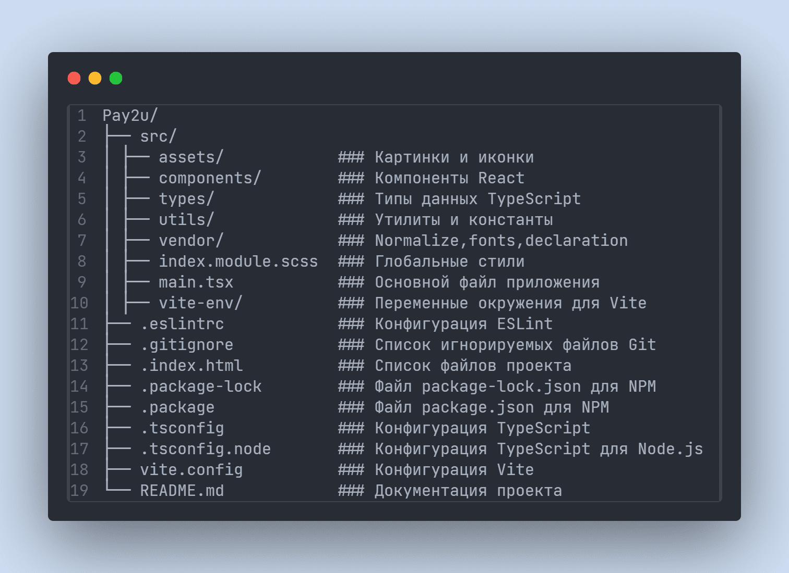
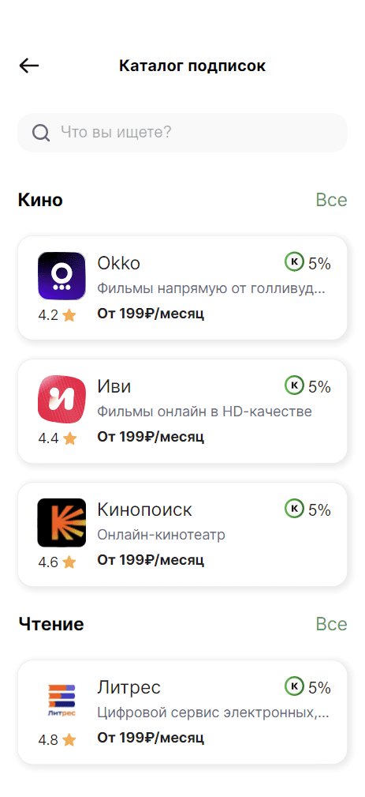
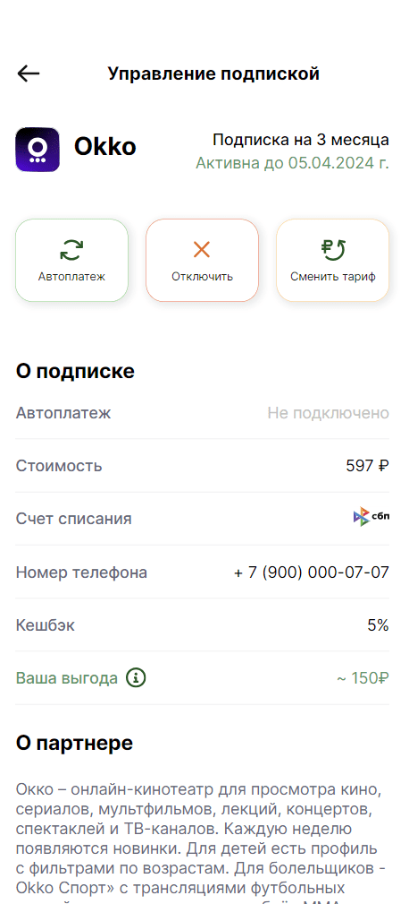
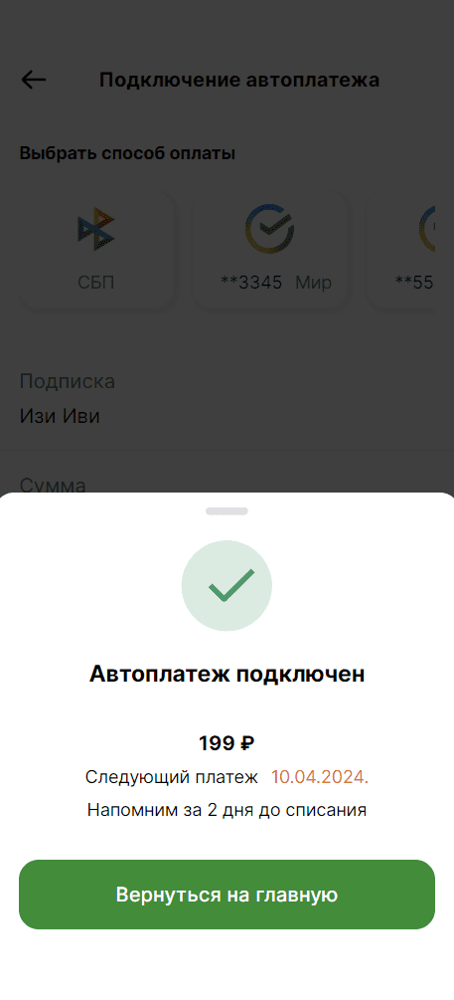
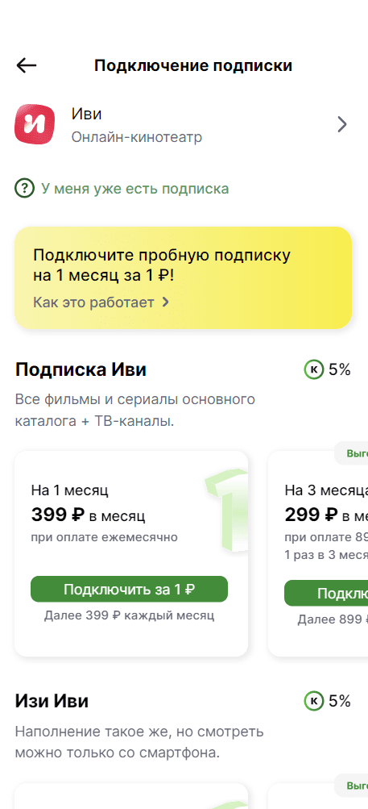

# Pay2u

## Описание проекта

Pay2u - это веб-приложение, разработанное для облегчения отслеживания подписок и возможности оформления новых подписок прямо в приложении. Оно предназначено для помощи пользователям в управлении и контроле за различными услугами и подписками, такими как стриминговые сервисы, музыка, кино и т. д..

## Используемые технологии

&nbsp
  &nbsp;
  &nbsp;
  &nbsp;

## Основные точки max,min width 375px

## Инструкции по установке и запуску

1. Клонируйте репозиторий: `git clone git@github.com:Olyaolya13/Pay2u__front.git`
2. Перейдите в директорию проекта: `cd Pay2u__front`
3. Установите зависимости: `npm install`
4. Запустите проект: `npm run dev`

## Структура проекта

## End points

- /history ( компонент History) истории подписок
- /services (компонент Services) главная страница развлекательные сервисы
- /sell_history (компонент SellHistory) история покупок
- /catalog (компонент CatalogSubscriptions) каталог подписок
- /categories (компонент CategoriesMovie) категории(Кино)
- /subscriptions (компонент MySubscriptions) мои подписки
- /manage_subcription (компонент ManageSubscription) упарвление подпиской по id
- /manage_subcription/id (компонент ManageSubscriptionWaitId) упарвление подписками
- /autopayment (компонент Autopayment) подключение автоплатежа
- /subscribe (компонент Subscribe) подключение подписки
- /subscribe/id (компонент AboutSubscribe) подключение подписки по id
- /subscription_payment (компонент SubscriptionPayment) оплата подписки

## Скриншоты

### При первом заходе на сайт появляются истории, которые объясняют преимущества оформления подписок

### С главной страницы попадаем в Истории подписок по клику на иконку часы или по одноименному компоненту, где показана деталицация покупок подписок

### С главной страницы попадаем в Каталог подписок на title 'Все', где отображены карточки подпискок, рассортированные по категориям с поиском

### В Категориях (в данном случае Кино) есть фильтрация, где можно сортировать по цене и рейтингу

### В Управлении подпиской мы попадаем из Мои подписки, есть возможность подключения автоплатежа,отключение подписки и смены тарица

### При подключении автоплатежа, появляется попап с информацией об успешном подключении, сумме и дальнейшем списании

### В Подключение подписок попадаем из Каталога подписок, кликнув по карточке подписки, представлена информация о тарифах

### При оплате подписки, появляется попап с промокодом и информацией о платеже, кнопка скопировать и перейти на сайт сервиса, кнопка вернуться в главное меню(Развлекательные сервисы), так же реализован тултип и возможность подключить автоплатеж, скачать чек

